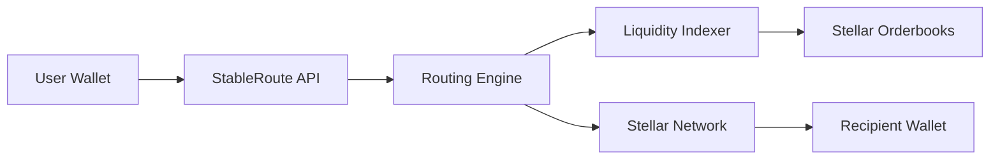
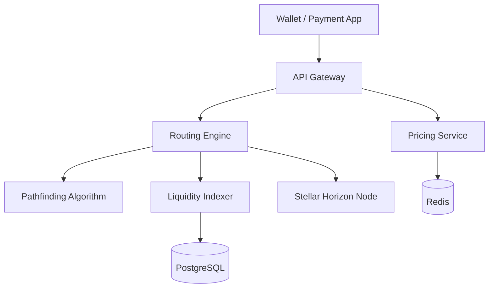
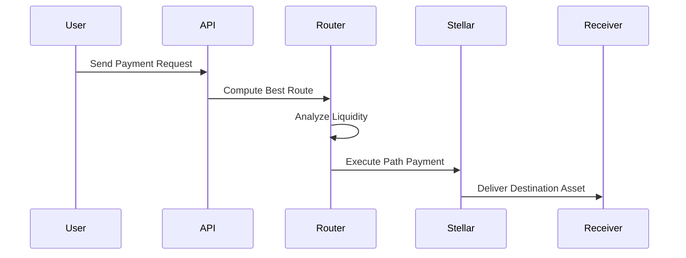
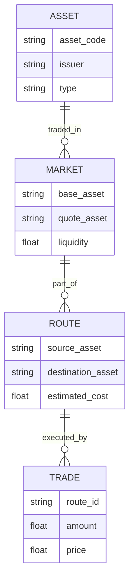

# StableRoute  
### Liquidity Router

StableRoute is a **stablecoin liquidity routing protocol built on the Stellar network** that automatically finds the most efficient path for cross-currency payments.

It acts as a **payment routing layer for Stellar assets**, optimizing how stablecoins and fiat tokens move across the network.

StableRoute enables applications, wallets, and payment providers to perform **cheapest-path asset swaps and cross-border payments** with minimal slippage and optimal liquidity.

The protocol functions similarly to **DEX aggregators like 1inch or Jupiter**, but specialized for **Stellar payments and stablecoin routing**.

---

## 1. Problem

The Stellar ecosystem contains a growing number of **stablecoins and fiat-backed tokens**:

- USDC
- EURC
- regional fiat tokens
- anchor-issued tokens
- tokenized banking assets

However, **liquidity is fragmented across multiple markets**.

### Example Scenario

A user wants to send money from **India to Europe**.
INR Token → USDC → EURC → EUR Anchor

Without routing optimization:

- users receive poor exchange rates
- liquidity pools may be insufficient
- routes are inefficient
- transactions experience higher slippage

### Key Challenges

| Problem | Impact |
|--------|--------|
| Fragmented liquidity | inefficient swaps |
| Manual route selection | poor UX |
| Slippage in large trades | higher costs |
| No routing infrastructure | developers must build custom logic |

This limits the scalability of Stellar as a **global settlement network**.

---

## 2. Solution

StableRoute provides a **routing engine for Stellar assets** that automatically determines the optimal path for asset conversion.

The router analyzes:

- liquidity across anchors
- orderbooks
- exchange rates
- available multi-hop paths

It then executes the **lowest-cost route automatically**.

### Example

User sends: **₹50,000**

StableRoute computes the optimal path:

```
INR Token → USDC → EURC → EUR Anchor
```

The payment reaches the recipient with the **best available exchange rate**.

---

## 3. Key Features

### Multi-Hop Asset Routing

Automatically finds the best conversion path between assets.

### Liquidity Discovery

Scans available anchors and orderbooks to determine liquidity depth.

### Slippage Optimization

Minimizes price impact for large payments.

### Automatic Payment Routing

Applications can send payments without worrying about route selection.

### Liquidity Analytics

Provides insights into liquidity distribution and market efficiency.

---

## 4. Why Stellar

StableRoute leverages Stellar's built-in financial infrastructure.

| Feature | Benefit |
|---------|---------|
| Built-in DEX | Native asset exchange |
| Path payments | multi-hop routing |
| Ultra-low fees | efficient micro-transactions |
| Fast settlement | ~5 seconds |
| Global anchors | fiat on/off ramps |

Stellar's **path payment functionality** makes it ideal for routing.

---

## 5. System Architecture



---

## 6. Component Architecture



---

## 7. Payment Routing Flow



---

## 8. Pathfinding Algorithm

StableRoute implements an optimized pathfinding algorithm similar to shortest-path routing in networks.

The algorithm evaluates:

- exchange rate
- liquidity depth
- slippage risk
- transaction fees
- number of hops

The best route is selected based on minimum effective cost.

Example candidate routes:

- **Route A:** INR → USDC → EURC → EUR
- **Route B:** INR → USDC → EUR
- **Route C:** INR → XLM → EURC → EUR

The router selects the optimal route dynamically.

---

## 9. Data Model



---

## 10. Tech Stack

| Layer | Technologies |
|-------|--------------|
| **Frontend** | Next.js, React, TailwindCSS, Stellar wallet integration |
| **Backend** | Golang / Node.js, REST APIs, gRPC services |
| **Blockchain** | Stellar Network, Horizon API, Stellar SDK |
| **Infrastructure** | Docker, Kubernetes, PostgreSQL, Redis, AWS / GCP |
| **Data Indexing** | event streaming, liquidity monitoring, real-time price aggregation |

---

## 11. Security Considerations

StableRoute includes multiple security protections.

| Layer | Protection |
|-------|------------|
| Transaction validation | prevents incorrect routing |
| Liquidity checks | avoids low liquidity pools |
| Slippage protection | prevents large price impacts |
| Rate limits | protects infrastructure |
| Monitoring | real-time anomaly detection |

---

## 12. Revenue Model

| Revenue Stream | Fee |
|----------------|-----|
| Payment routing | 0.1–0.3% |
| Enterprise payment API | subscription |
| Liquidity analytics | premium access |
| Institutional integrations | enterprise licensing |

---

## 13. Future Roadmap

- **Phase 1:** basic routing engine, Stellar path payment integration, liquidity monitoring
- **Phase 2:** advanced routing optimization, developer SDK, analytics dashboard
- **Phase 3:** institutional payment routing, cross-chain routing, automated liquidity markets

---

## 14. Potential Impact

StableRoute enables efficient cross-border payments and stablecoin transfers.

Benefits include:

- better exchange rates
- reduced slippage
- automated payment routing
- improved liquidity utilization

This positions StableRoute as a core infrastructure layer for the Stellar payment ecosystem.

---

## Repository Structure

- **stableroute-frontend** — Next.js wallet / payment app
- **stableroute-backend** — API gateway, routing engine, pricing service
- **stableroute-contracts** — Soroban smart contracts (Stellar)

---

## License

MIT
